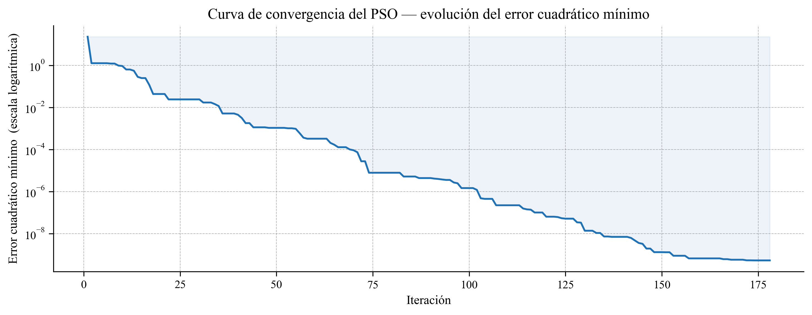
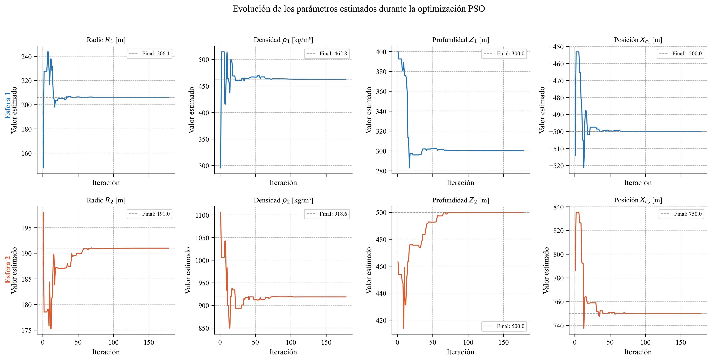
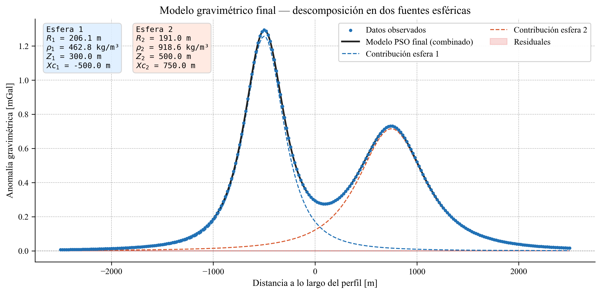
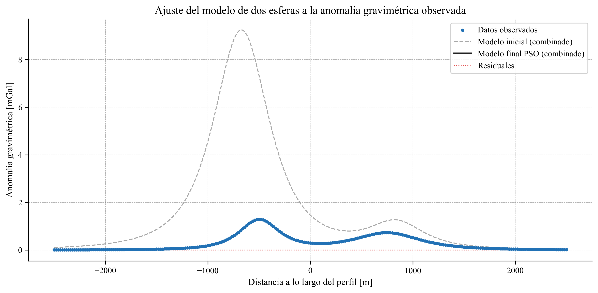

# Optimización Global (PSO) para Inversión de Señales Complejas

**Objetivo del Proyecto:** Desarrollar un algoritmo de Optimización por Enjambre de Partículas (PSO) para resolver un problema inverso no lineal complejo: la estimación paramétrica de fuentes a partir de una señal superpuesta (Anomalía Gravimétrica).

**El Desafío Analítico:** A diferencia de los problemas de regresión convexa donde existen soluciones analíticas, la inversión de señales complejas presenta múltiples mínimos locales. El reto consistió en programar un optimizador heurístico capaz de explorar un espacio de búsqueda continuo (de 8 dimensiones) y converger hacia el óptimo global minimizando una función de pérdida (Loss Function).

---

## Valor y Relevancia en Data Science
Este proyecto ejemplifica el uso de  herramientas computacionales que subyacen al entrenamiento de modelos de Machine Learning (como Redes Neuronales):
1. **Algoritmia Personalizada:** Implementación orientada a objetos de un optimizador estocástico complejo (PSO) en Python (NumPy), sin depender de librerías de "caja negra" (ej. `scipy.optimize`).
2. **Optimización Restringida:** Diseño de funciones de costo (Loss Functions) que incluyen penalizaciones (*constraints*) dinámicas para evitar gradientes que conduzcan a soluciones matemáticamente válidas pero ilógicas para el contexto del problema.
3. **Modelado No Lineal:** Descomposición matemática de una señal superpuesta en componentes individuales mediante la iteración de un *Forward Model*.

---

## Herramientas Tecnológicas
* **Lenguaje:** Python
* **Cálculo Numérico y Vectorización:** `NumPy` (Optimización del rendimiento algorítmico).
* **Manejo de Datos:** `Pandas`
* **Visualización Dinámica y Reportes:** `Matplotlib`.

---

## Metodología del Algoritmo (PSO)

El algoritmo PSO simula el comportamiento de un enjambre, donde múltiples "agentes" o "partículas" exploran el espacio de soluciones.

* **Espacio de Búsqueda:** Estimación simultánea de 8 parámetros continuos (Radio, Densidad, Profundidad y Coordenada X para dos fuentes esféricas distintas).
* **Función de Pérdida (Loss Function):** Suma de Errores al Cuadrado (SSE) entre la señal observada y el modelo teórico generado en cada iteración.
* **Control de Hiperparámetros:** Ajuste fino del factor de inercia ($w$), aceleración cognitiva ($c_1$) y aceleración social ($c_2$) para balancear la fase de exploración (búsqueda global) y explotación (convergencia local).

---

## Resultados y Auditoría del Modelo

### 1. Auditoría de Convergencia (Loss Curve)
Al igual que en el entrenamiento de redes neuronales profundas, es crucial auditar cómo el algoritmo "aprende" en el tiempo. La siguiente curva en escala logarítmica demuestra la eficacia del modelo para escapar de mínimos locales y minimizar el error cuadrático a lo largo de las iteraciones.



### 2. Estabilidad de los Parámetros (Epochs)
El rastreo de la evolución de las estimaciones asegura que el modelo ha alcanzado un estado de convergencia estable, garantizando que el *Global Best* (la mejor solución histórica) sea confiable.



### 3. Modelo Predictivo vs. Datos Observados
El resultado final muestra el excelente ajuste del optimizador. La señal original fue descompuesta matemáticamente con éxito en dos fuentes subyacentes distintas, logrando una reconstrucción fiel con residuales mínimos y centrados en cero.






---

## Reproducibilidad y Arquitectura del Código

El código se desarrolló aplicando principios de programación orientada a objetos (OOP) para asegurar su modularidad y escalabilidad en pipelines de datos más grandes.

**Estructura del pipeline:**
```python
# 1. Definición de límites del espacio de búsqueda (Boundaries)
param_bounds = [(50, 1000), (500, 2500), (110, 1000), (-1000, 0)] * 2

# 2. Instanciación del optimizador
optimizer = GravimetricInversionPSO(num_particles=30, max_iter=200)

# 3. Entrenamiento (Minimización del SSE)
optimizer.fit(X_obs, y_obs, bounds=param_bounds)
